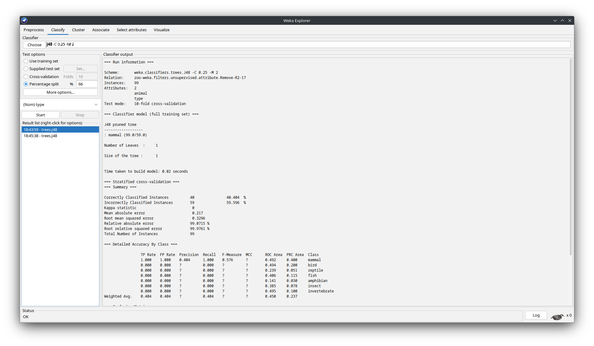

## Building the classifier

### J48 with 10-fold Cross-validation

</img>

### 10-fold Cross-validation vs. default percentage split

For the comparison of the models, the classification error must be considered. The model with 10-fold cross-validation correctly classified 40 of the 99 instances correctly (40.404 %), while the model with the default percentage split of 66 % only classified 10 out of 34 instances correctly (29.4118 %).
