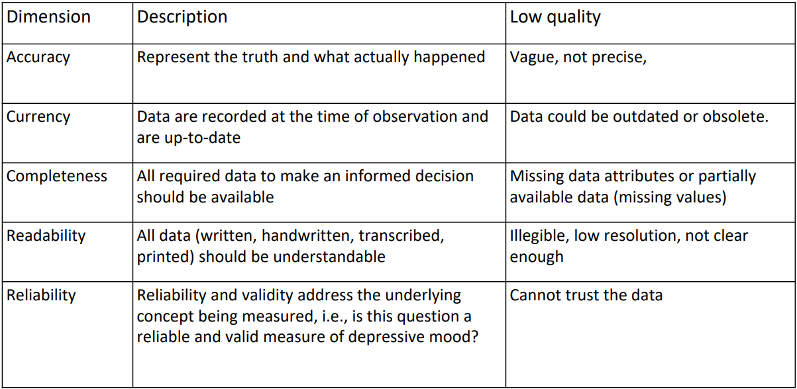
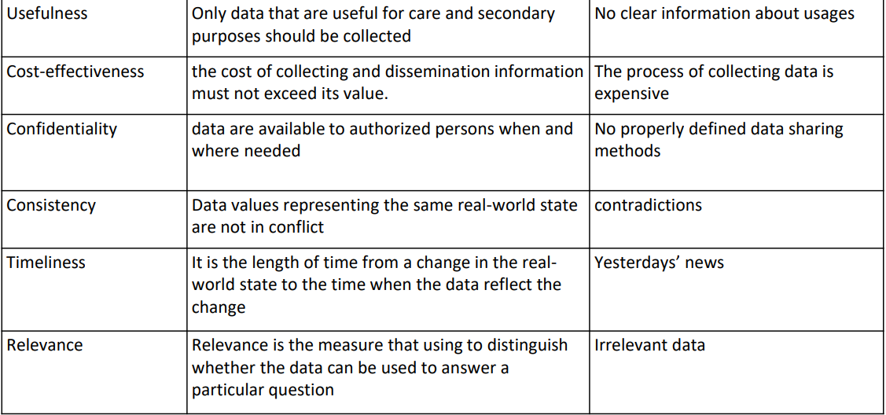
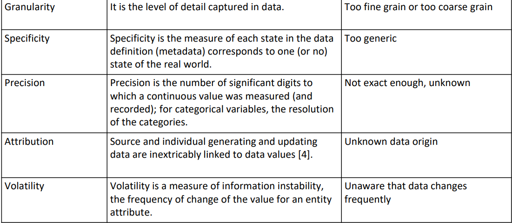

## exampleData.csv

- Income has two severe outliers (both Students) and therefore needs to be generalized.
- Inconsistencies in col Street (Prinz Eugen-Straße is missing a `-`)
- No metadata: measurement units are missing in income, age

