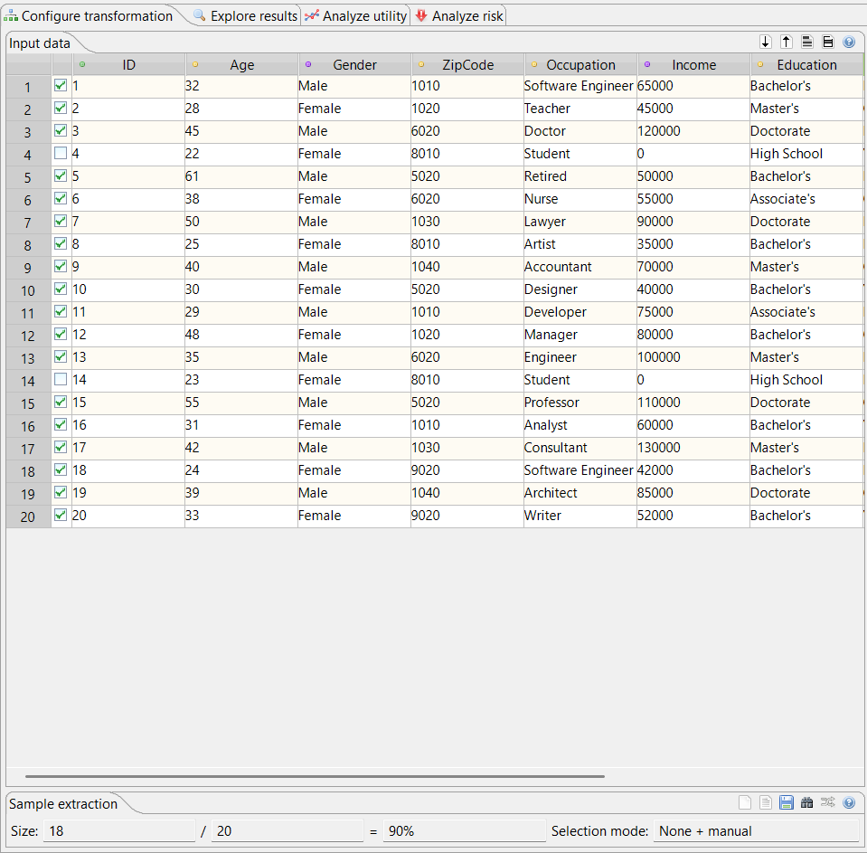

## Sensitive Attributes

- ### Categorization of Attributes Regarding Sensitivity

a. Can the dataset be attacked with the dataset friends?

- Without additional data(-sets) an attack would not be possible, since no attribute has identifying property (personal opinion). However, in combination with additional data about the same individuals, as provided in the friends.csv dataset, it is possible to draw some conclusions easily (e.g. about the income of Eva Berger via attribute Street/Address).

b. Can the income of a study colleague, a 24-year-old female, be determined?

- Via the common attributes Street/Address and Age the desired entity can be identified by joining the datasets. The procedure to determine that entity's salary (or any numerical attribute) is to compare the average salary of all entities apart from the desired one with the average salary of all entities apart from one's own (which is known). This is called a Tracker.